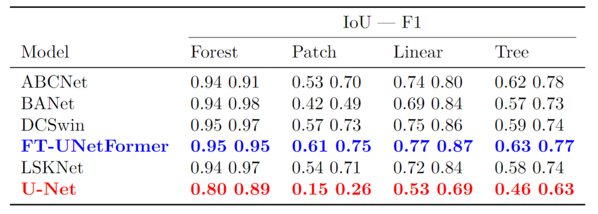

## Introduction

**TOFSeg** is an open-source  semantic segmentation toolbox based on PyTorch, [pytorch lightning](https://www.pytorchlightning.ai/) and [timm](https://github.com/rwightman/pytorch-image-models), 
which mainly focuses on detecting Trees outside Forest in high resolution aerial images. Many thanks to [Libo Wang](https://github.com/WangLibo1995) for creating [GeoSeg](https://github.com/WangLibo1995/GeoSeg) from which this one is forked. For new updates regarding the Deep-Learning architectures please check [here](https://github.com/WangLibo1995/GeoSeg).


## Major Features

- Segmentation and classification of aerial imagery into four trees outside forest classes (Forest, Patch, Linear, Tree)
- Six trained models [available](https://myshare.uni-osnabrueck.de/d/1926bba15b42484282fc/)
- Can handle large inference images by slicing and stitching them together using overlapping predictions

## Supported Networks

- Vision Transformer

  - [UNetFormer](https://authors.elsevier.com/a/1fIji3I9x1j9Fs) 
  - [DC-Swin](https://ieeexplore.ieee.org/abstract/document/9681903)
  - [BANet](https://www.mdpi.com/2072-4292/13/16/3065)
  
- CNN
 
  - [MANet](https://ieeexplore.ieee.org/abstract/document/9487010) 
  - [ABCNet](https://www.sciencedirect.com/science/article/pii/S0924271621002379)
  - [A2FPN](https://www.tandfonline.com/doi/full/10.1080/01431161.2022.2030071)
  - [LSKNet](https://doi.org/10.1007/s11263-024-02247-9)
  - [U-Net](https://arxiv.org/abs/1505.04597)
  
## Folder Structure

Prepare the following folders to organize this repo:
```none
airs
├── GeoSeg (code)
├── pretrain_weights (pretrained weights of backbones, such as vit, swin, etc)
├── model_weights (save the model weights trained on ISPRS vaihingen, LoveDA, etc)
├── fig_results (save the masks predicted by models)
├── lightning_logs (CSV format training logs)
├── data
│   ├── tof
│   │   ├── train_images (original)
│   │   ├── train_masks (original)
│   │   ├── val_images (original)
│   │   ├── val_masks (original)
│   │   ├── test_images (original)
│   │   ├── test_masks (original)
│   │   ├── test_masks_eroded (original)
│   │   ├── train (processed)
│   │   ├── val (processed)
│   │   ├── test (processed)
│   ├── sites
│   │   ├── site name
│   │   |   ├── TOP (True Orthophoto)     Name: TOP_id.tif
│   │   |   ├── SHP (Reference Shapefile) Name: site_name_TOF.shp
```

## Install

Open the folder **TOFSeg** using **Linux Terminal** and create python environment:
```
conda create -n airs python=3.8
conda activate airs
pip3 install torch torchvision torchaudio --index-url https://download.pytorch.org/whl/cu118
pip install -r GeoSeg/requirements.txt
```

## Pretrained Weights of Backbones

[Baidu Disk](https://pan.baidu.com/s/1foJkxeUZwVi5SnKNpn6hfg) : 1234 

[Google Drive](https://drive.google.com/drive/folders/1ELpFKONJZbXmwB5WCXG7w42eHtrXzyPn?usp=sharing)

## Trained Models for Trees outside Forest Segmentation

[Download](https://myshare.uni-osnabrueck.de/d/1926bba15b42484282fc/)



## Data Preprocessing

### Create Reference Data (optional)
Create your own reference data using this [repository](https://github.com/Moerizzy/Manual_TOF_Detection.git). Be aware that manual refinement will be required!

Create images (masks) in the same size as orthophotos from shapefiles.
```
python GeoSeg/tools/create_masks.py --state "site name" --epsg "EPSG:25833"
```


Define the training, validation and test split (here 90, 5, 5). This will split the data so that all classes are equally distributed. It is set up for 100 files.
```
python GeoSeg/tools/data_statistics.py --state "site name"
```

Copy the files into the designated training, validation and testing folders.
```
python GeoSeg/tools/copy_files.py
```

### Spliting the Data

Generate the training set.
```
python GeoSeg/tools/tof_patch_split.py \
--img-dir "data/tof/train_images" \
--mask-dir "data/tof/train_masks" \
--output-img-dir "data/tof/train/images_1024" \
--output-mask-dir "data/tof/train/masks_1024"\
 --mode "train" --split-size 1024 --stride 1024 \
```
Generate the validation set.
```
python GeoSeg/tools/tof_patch_split.py \
--img-dir "data/tof/val_images" \
--mask-dir "data/tof/val_masks" \
--output-img-dir "data/tof/val/images_1024" \
--output-mask-dir "data/tof/val/masks_1024"\
 --mode "val" --split-size 1024 --stride 1024 \
```
Generate the testing set.
```
python GeoSeg/tools/tof_patch_split.py \
--img-dir "data/tof/test_images" \
--mask-dir "data/tof/test_masks" \
--output-img-dir "data/tof/test/images_5000" \
--output-mask-dir "data/tof/test/masks_5000" \
--mode "val" --split-size 5000 --stride 5000 \
```

## Training

"-c" means the path of the config, use different **config** to train different models.

```
python GeoSeg/train_supervision.py -c GeoSeg/config/tof/ftunetformer.py
```

## Testing

"-c" denotes the path of the config, Use different **config** to test different models. 

"-o" denotes the output path 

"-t" denotes the test time augmentation (TTA), can be [None, 'lr', 'd4'], default is None, 'lr' is flip TTA, 'd4' is multiscale TTA

"--rgb" denotes whether to output masks in RGB format

```
python GeoSeg/tof_test.py -c GeoSeg/config/tof/unetformer.py -o fig_results/tof/unetformer --rgb
```

## Inference on Huge Areas

This function takes an image folder and performs inference. It predicts overlapping predictions, which can be adjusted using "-st" and "-ps". These are merged by averaging the probability scores and output as a georeferenced GeoTIF and ShapeFile in the size of the original images.

"i" denotes the input image folder 

"-c" denotes the path of the config, Use different **config** to test different models. 

"-o" denotes the output path 

"-t" denotes the test time augmentation (TTA), can be [None, 'lr', 'd4'], default is None, 'lr' is flip TTA, 'd4' is multiscale TTA

"-st" denotes the stride in pixels for each patch that will be predicted.

"-ps" denotes the patch size that will be predicted

"-b" denoted the batch size


```
python GeoSeg/inference_huge_image.py \
-i data/inference/images \
-c GeoSeg/config/tof/ftunetformer.py \
-o data/inference/mask \
-st 256 \
-ps 1024 \
-b 2 \
```

## Citation

If you find this project useful in your research, please consider citing：

- [Mapping Trees Outside Forests Using Semantic Segmentation](https://doi.org/10.1109/IGARSS53475.2024.10641035)


## Acknowledgement

We hope that **TOFSeg** will serve the growing remote sensing research community by providing a benchmark for tree segmentation outside of forests. 
and inspire researchers to develop their own segmentation networks. Many thanks to the following projects for their contributions to **TOFSeg**.
- [GeoSeg](https://github.com/WangLibo1995/GeoSeg)
- [pytorch lightning](https://www.pytorchlightning.ai/)
- [timm](https://github.com/rwightman/pytorch-image-models)
- [pytorch-toolbelt](https://github.com/BloodAxe/pytorch-toolbelt)
- [ttach](https://github.com/qubvel/ttach)
- [catalyst](https://github.com/catalyst-team/catalyst)
- [mmsegmentation](https://github.com/open-mmlab/mmsegmentation)
